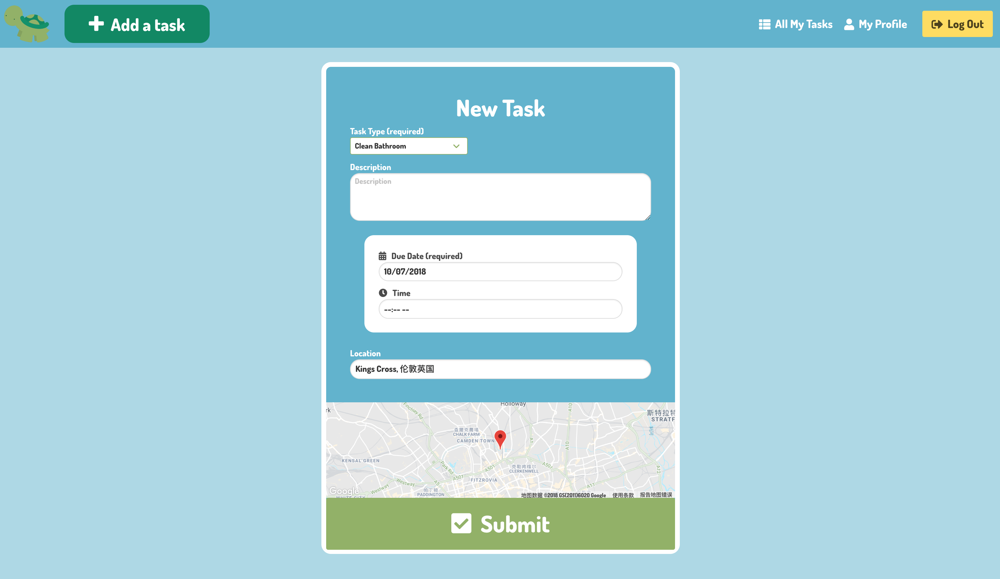

<!-- PROJECT 3
Day 1 decisions.
What problem are we trying to solve? We have decided that fundamentally we want to provide a way of making the "every-day to day fun". -->

# Turtle to-do
---
(8 days group project)


## Table of Contents

* [Links](#links)
* [Description](#description)
* [Technologies Used](#technologies-used)
* [Screenshots](#screenshots)
* [Code Examples](#code-examples)
* [Challenges](#challenges)
* [Wins](#wins)

## Link

* [Heroku](https://turtle-to-do.herokuapp.com/)

Login with email *user1@user1* and password *u1* to try using the app.

## Description

**Gamified to-do app, designed to help the user keep track of performing daily tasks by rewarding the user for completing tasks that they have assigned themselves. This was my first experience with a front-end framework. Built with Alex Poynter.**

## Technologies Used

- AngularJS
- Node.js
- CSS3 (with SASS and BULMA)
- HTML5

## Approach Taken

From day 1 of this project, we have decided that fundamentally we want to provide a way of gamifying mundane day-to-day activities. One of the decisions we made before we began to build any of the app was that our app was not going to rely heavily on any one external API - we didn't wish our app to be a "wrapper" for functionality that was provided externally. Instead, the idea was to make the app rewarding and useful to use in and of itself, and to us this meant that firstly the app had to be at least a little bit fun and amusing and that secondly the user would be able to get some sense of accomplishment from using it.

To that end, we went the obvious route of having a points system as some sort of in-app "currency". We also decided quite early on that we could have some sort of "levels" system in order to help the player keep track of how often they have done a certain task, under the premises that watching progress unfold and watching numbers accumulate is rewarding. I felt that there was a danger of the app becoming overly complex and no longer fun if we started introducing too many variables to the user, and if we gave the user too many choices, so it was important to me that all tasks the user could enter were always worth 5 points, since that gives the user one less thing to think about. To that end, we also made much of the form for inputting a new task optional, since my ideal was that the user should only have to input a minimal amount of data but be rewarded with the maximum amount of information derived from that input in return.

As a final little gimmick, we did a little bit of our own data visualisation, with progress bars for displaying the user's history with their tasks and the progress in leveling up their tasks. Overall, it was great exploring Angular while working on this project and I feel that this is the project where I've really started becoming confident in working in the back-end.

Andrew Xu

## Screenshots

Main page displaying restaurants:


Show page for a single restaurant:


Viewing a user profile and the restaurants added by that user:


Form for creating a new task:


## Code Examples

Here are some of the code snippets in this project that I found the most interesting and challenging to write.

_Example 1: Function in the back-end tasks controller for when the user completes a task._

```javascript
function tasksComplete(req, res, next) {
  User
    .findById(req.params.id)
    .then(user => {
      if(user.id === req.currentUser.id) {
        const task = user.tasks.id(req.params.taskId);
        if (!user.score) {
          user.score = 0;
        }
        user.score += 5;
        if (!user[`${task.title}Score`]) {
          user[`${task.title}Score`] = 0;
        }
        user[`${task.title}Score`] += 5;
        task['completedDate'] = moment().format('YYYY-MM-DD');
        user.completedTasks.push(task);
        task.remove();
        return user.save()
          .then((user) => {
            res.json(user.tasks);
          });
      } else {
        res.json({ message: 'Unauthorized' });
      }
    })
    .catch(err => next(err));
}
```

This function is where the scorekeeping was done in the back-end when a user completed their task. It needed to add 5 to the user's total score for all tasks, creating a `user.score` for total scores if there isn't one, then it needed to add 5 to the score for that type of task, creating a ``user[`${task.title}`Score]`` if there isn't one.

_Example 2: Indexing a user's tasks._

```javascript
function tasksIndex(req, res) {
  const allTasks = [];
  allTasks.push(req.currentUser.tasks.filter(task => {
    // Pushing all tasks that are supposed to be for today.
    if (task.dueDate === moment().format('YYYY-MM-DD')) {
      return task;
    }
  }));
  allTasks.push(req.currentUser.tasks.filter(task => {
    // Pushing all tasks that are supposed to be for the past.
    if (moment(task.dueDate).isBefore(moment().format('YYYY-MM-DD'))) {
      return task;
    }
  }));
  allTasks.push(req.currentUser.tasks.filter(task => {
    // Pushing all tasks that are supposed to be for the future.
    if (moment(task.dueDate).isAfter(moment().format('YYYY-MM-DD'))) {
      return task;
    }
  }));
  res.json(allTasks);
}
```

This function, which also appears in the back-end task controller, was cool to write because it extensively used functionality that was built into Moment.js. Because of the way we wanted to display data in the front-end of our app, we felt it would be better to effectively have two "user show" endpoints in the back-end, one for indexing the user's currently uncompleted tasks, and another for indexing the user's scores and the user's data. This endpoint would return an array of three arrays, giving today's tasks, past unfinished tasks, and future tasks.

## Challenges

* There was one strange situation where we couldn't save an object inside of a user in the database. This required some really hacky workarounds both in the front-end and in the back-end.
* Working with Moment.js and fiddling with date formats was a little bit of a headache sometimes, but it was still probably better than using the JS `Date()` constructor.

## Wins

* The score system and data visualization was a lot of fun to do.
* I'm quite happy with the UX/UI in general and with how the CSS turned out, especially on the User Profile page.
