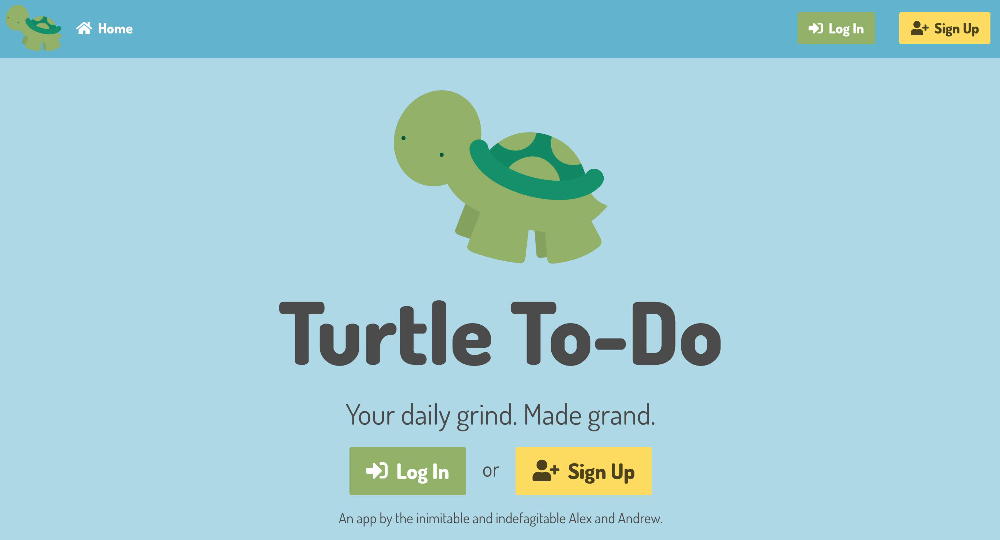
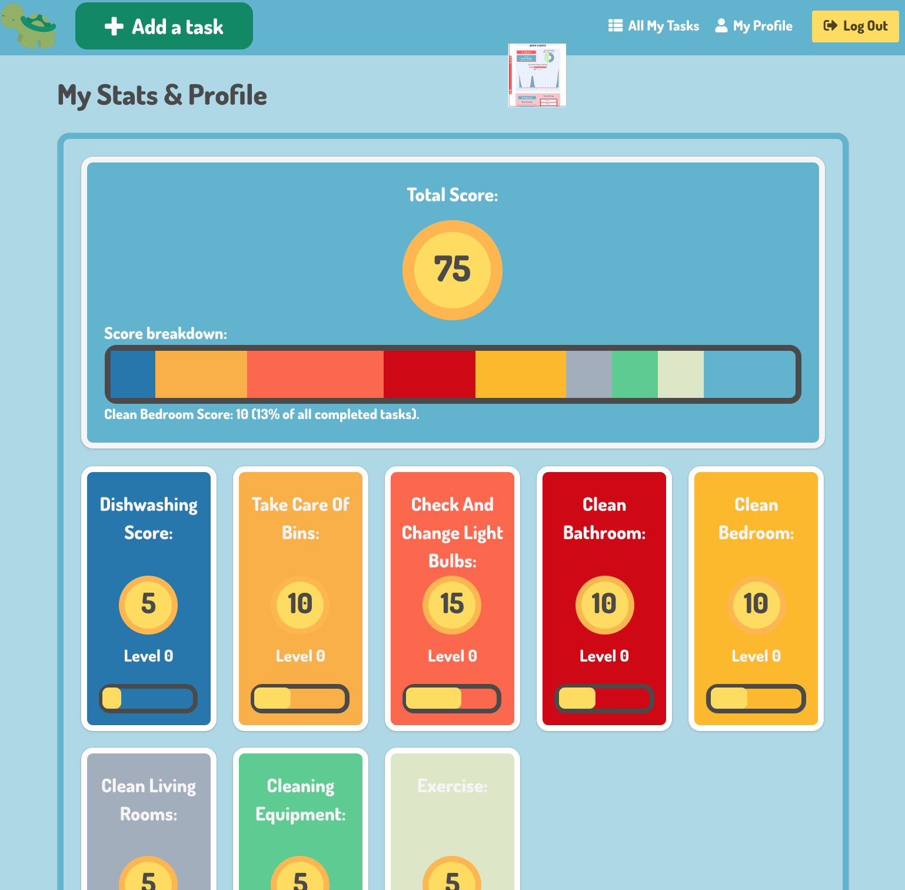
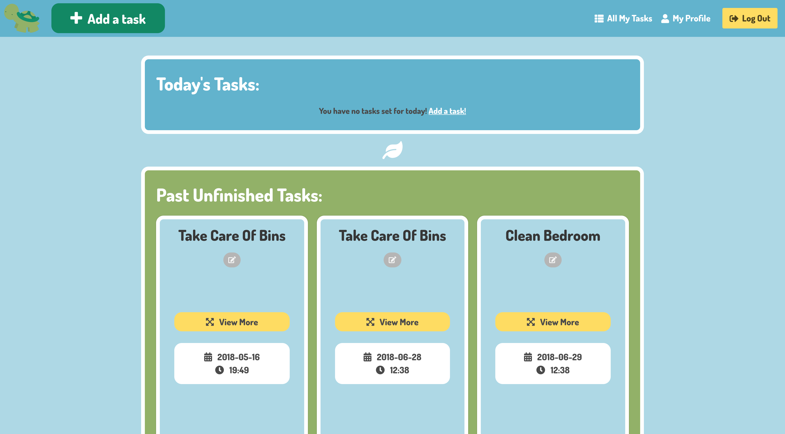
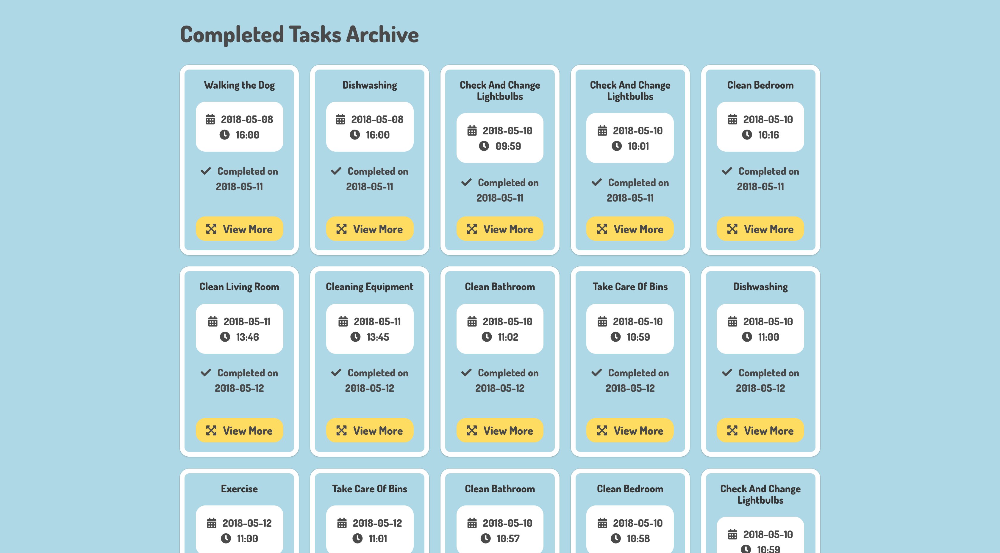

# Turtle to-do
---
(8 days group project)



## Table of Contents

* [Links](#links)
* [Description](#description)
* [Technologies Used](#technologies-used)
* [Screenshots](#screenshots)
* [Code Examples](#code-examples)
* [Challenges](#challenges)
* [Wins](#wins)

## Link

* [Heroku](https://turtle-to-do.herokuapp.com/)

## Description

**...**

## Technologies Used

- ...

## Approach Taken

...

## Screenshots

Main page displaying restaurants:


Show page for a single restaurant:


Viewing a user profile and the restaurants added by that user:


## Code Examples

Here are some of the code snippets in this project that I found the most interesting and challenging to write.

_Example 1: Calculating and displaying the average ratings for each restaurant._

```javascript
...
```

...

_Example 2: Making a request to the Google Static Maps API._

```javascript
...
```

...

## Challenges

* ...

## Wins

* ...
