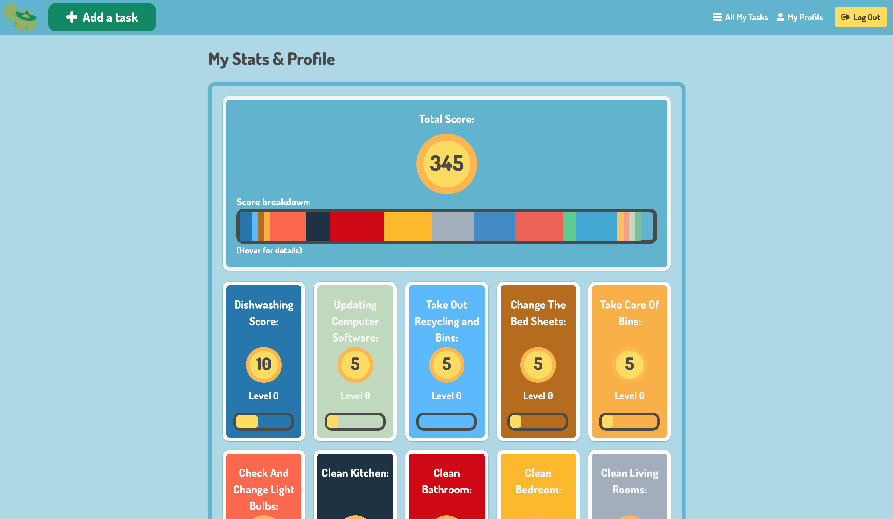

<!-- PROJECT 3
Day 1 decisions.
What problem are we trying to solve? We have decided that fundamentally we want to provide a way of making the "every-day to day fun". -->

# Turtle to-do
---
(8 days group project)


## Table of Contents

* [Links](#links)
* [Description](#description)
* [Technologies Used](#technologies-used)
* [Screenshots](#screenshots)
* [Code Examples](#code-examples)
* [Challenges](#challenges)
* [Wins](#wins)

## Link

* [Heroku](https://turtle-to-do.herokuapp.com/)

## Description

**Gamified to-do app, designed to help the user keep track of performing daily tasks by rewarding the user for completing tasks that they have assigned themselves. This was my first experience with a front-end framework. Built with Alex Poynter.**

## Technologies Used

- AngularJS
- Node.js
- CSS3 (with SASS and BULMA)
- HTML5

## Approach Taken

From day 1 of this project, we have decided that fundamentally we want to provide a way of gamifying mundane day-to-day activities. One of the decisions we made before we began to build any of the app was that our app was not going to rely heavily on any one external API - we didn't wish our app to be a "wrapper" for functionality that was provided externally. Instead, the idea was to make the app rewarding and useful to use in and of itself, and to us this meant that firstly the app had to be at least a little bit fun and amusing and that secondly the user would be able to get some sense of accomplishment from using it.

To that end, we went the obvious route of having a points system as some sort of in-app "currency".

## Screenshots

Main page displaying restaurants:


Show page for a single restaurant:


Viewing a user profile and the restaurants added by that user:


## Code Examples

Here are some of the code snippets in this project that I found the most interesting and challenging to write.

_Example 1: Calculating and displaying the average ratings for each restaurant._

```javascript
...
```

...

_Example 2: Making a request to the Google Static Maps API._

```javascript
...
```

...

## Challenges

* ...

## Wins

* ...
